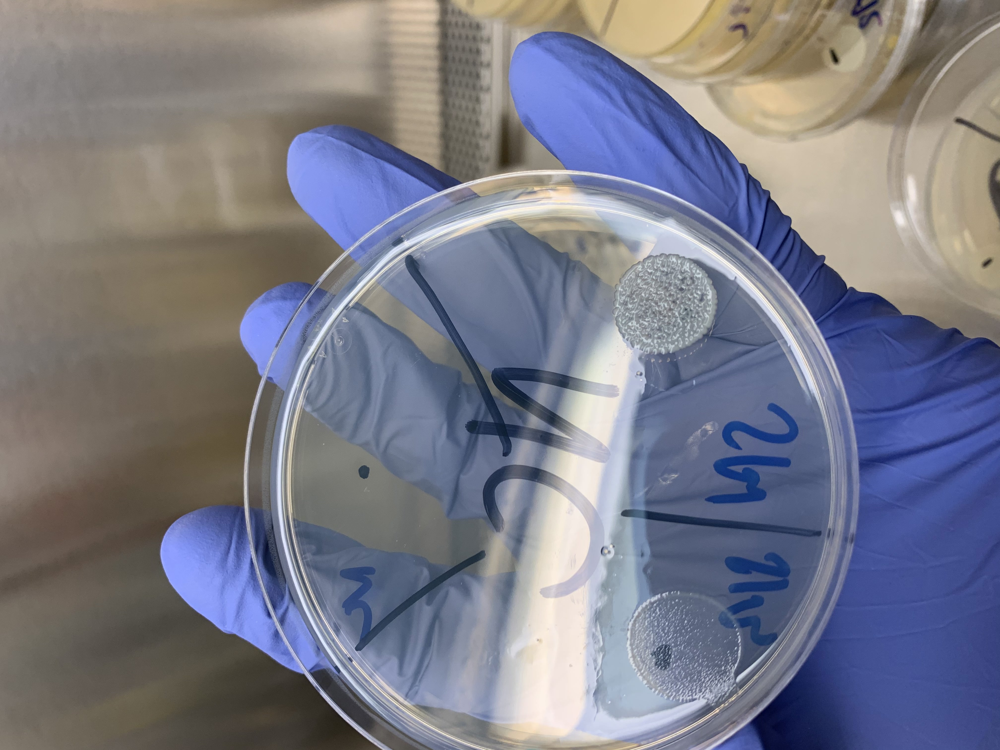

***

Our first objective was to describe the phylogeny of non-aureus Staphylococci and Mammaliicoci (NASM) isolates collected from the teat apex of dairy cows, including the distribution of genes related to antimicrobial peptides (AMPs), virulence, and antimicrobial resistance. Our secondary objective was to explore associations between the NASM phylogeny, in vitro inhibitory activity, and the presence of Staphylococcus aureus (SAU) and Streptococcus and Streptococcus-like organisms (SSLO) intramammary infections (IMI) in the cows from which the NASM were isolated. 

 

